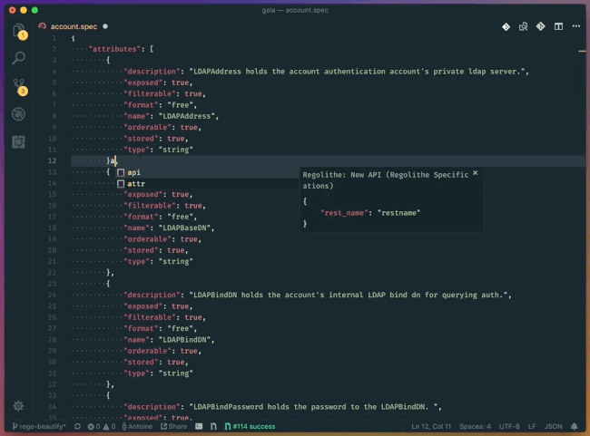
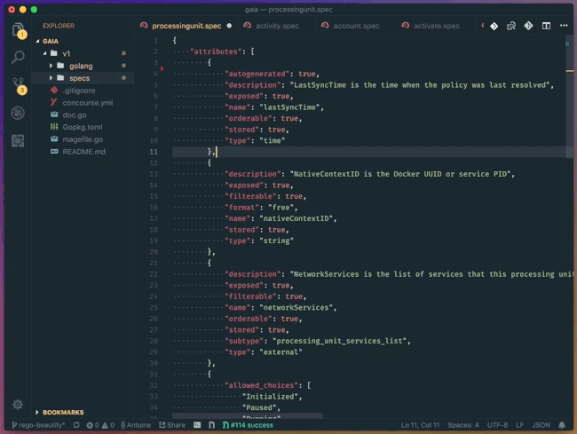

# regolithe-specifications

This package provides snippets and schema validation for Regolithe Specifications.

## Features

### Schema validation

The VSCode Regolithe extensions provides auto completion, validation and documentation of specification files using the intgrated json schema

### Snippets

To quicky edit specification, the extensions adds the following snippets

- `spec<tab>`: creates a skeleton for a new specification file
- `attr<tab>`: adds a new attribute
- `rel<tab>`: adds a new relation

### Linting

In order to keep you specification files clean, the extensions will sort and lint the specification on save, keeping things in order

### Auto codegen

You can create a file named `.regolithe-gen-cmd` in the root folder of the specification that contains the command to run to generate your specification.

